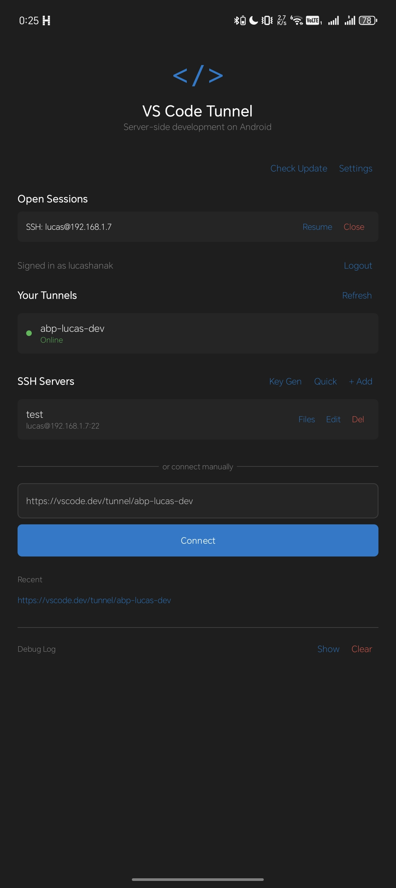
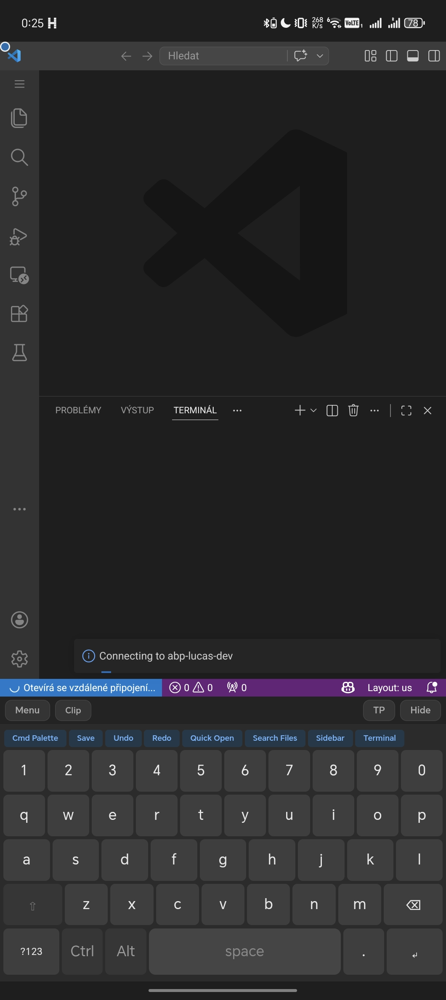
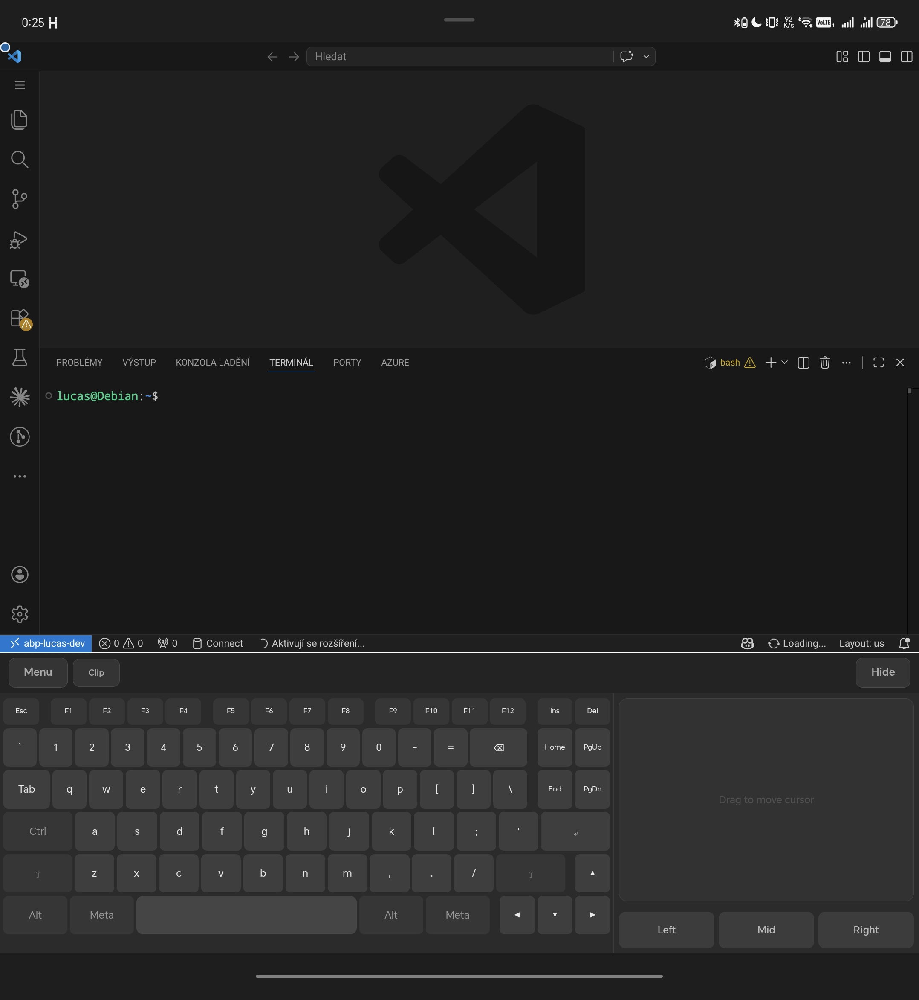
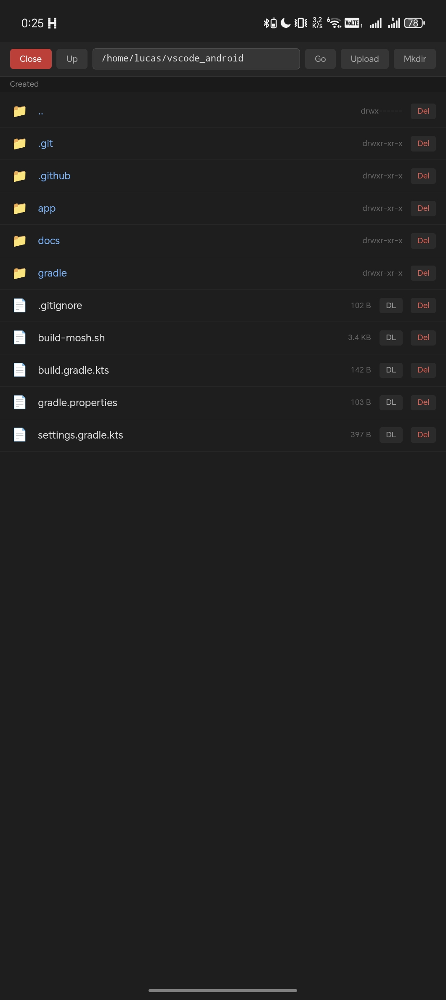
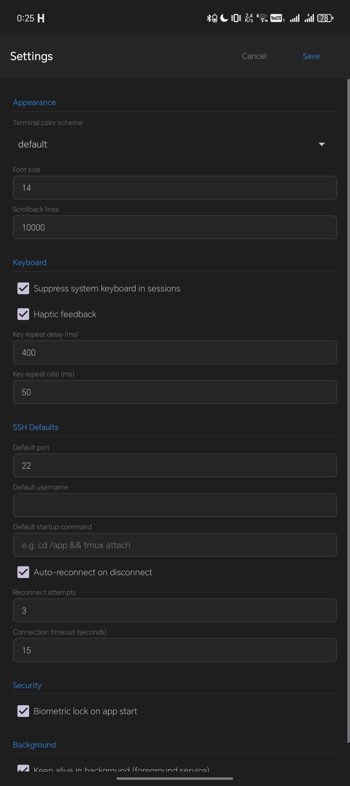

# VS Code Tunnel for Android

A native Android client for [VS Code Remote Tunnels](https://code.visualstudio.com/docs/remote/tunnels) with a built-in SSH client, custom overlay keyboard, and SFTP file browser. Designed for server-side development on phones and foldables.

<p align="center">
  
  
  
</p>

## Features

### VS Code Tunnel Client
- Connect to VS Code Remote Tunnels via GitHub authentication
- Browse and connect to your tunnel machines
- Open specific folders via URL (`vscode.dev/tunnel/host/path/to/folder`)
- Multiple simultaneous sessions with suspend/resume
- Auto-reconnect on app restart with saved session URLs
- Native auth popup handling (GitHub OAuth flow)

### Custom Overlay Keyboard
- **Gboard-style compact layout** with number row, row stagger, and large keys
- **PC keyboard layout** on wide displays (foldables/tablets) with F-keys and nav cluster
- **Long-press diacritics** — hold `e` → slide to `ě`, `é`, `ê` (Czech/Slovak/Polish)
- **Quick action bar** — one-tap shortcuts: Cmd Palette, Save, Undo, Redo, Search, Terminal
- **Key repeat** — hold any key for auto-repeat (configurable delay/rate)
- **Haptic feedback** — configurable vibration on key press
- **Clipboard history** — last 10 copied texts, accessible from toolbar
- **Touchpad** — mouse cursor control, click, right-click, scroll, drag-select

### SSH Client
- **Saved servers** with host, port, username, password/key authentication
- **Quick Connect** — type `user@host:port` and go
- **SSH key generation** — ED25519 or RSA-4096 directly in the app
- **SSH key file picker** — import `.pem` keys from device storage
- **Startup commands** — auto-run commands after connection (e.g. `cd /app && tmux attach`)
- **Port forwarding** — local and remote (`L8080:127.0.0.1:80`, `R3000:localhost:3000`)
- **Auto-reconnect** — configurable retry attempts on connection loss
- **Known hosts (TOFU)** — saves fingerprint on first connect, warns on change
- **Custom snippets** — configurable command buttons in terminal toolbar
- **Mosh support** — UDP-based connection via native `mosh-client` binary (auto-built in CI)

### SSH Terminal (xterm.js)
- Full terminal emulator with xterm.js 5.5
- **Text selection** by finger drag + Android-style teardrop handles
- **Context menu** (2-finger tap) — Copy, Paste, Select All, Clear, Search, Export
- **Terminal search** — find text in scrollback (xterm addon-search)
- **Clickable URLs** — detected links open in browser (xterm addon-web-links)
- **Pinch-to-zoom** — adjust font size with two fingers
- **5 color schemes** — Default, Solarized Dark, Dracula, Monokai, Linux
- **System keyboard suppression** — prevents Android keyboard from interfering

### SFTP File Browser
- Browse remote filesystems with directory navigation
- **Multi-select** — checkboxes + long-press to select multiple files/folders
- **Multi-file upload** — select multiple files from device at once
- **Multi-file download** — download selected items with progress bar
- **Recursive folder download** — downloads entire directory trees
- **Recursive folder delete** — rm -rf with confirmation
- **Create directories** (mkdir) and delete files

<p align="center">
  
  
</p>

### Settings
- **Appearance** — terminal color scheme, font size, scrollback lines
- **Keyboard** — suppress system keyboard, haptic feedback, key repeat timing
- **SSH Defaults** — port, username, startup command, auto-reconnect, timeout
- **Security** — biometric lock (fingerprint/face/PIN) on app start
- **Background** — foreground service with WakeLock for persistent connections

### Other
- **In-app updates** — download and install APK directly from GitHub Releases
- **Background keepalive** — foreground service prevents Android from killing connections
- **Session management** — suspend/resume multiple tunnel and SSH sessions
- **Auto-reconnect on restart** — offers to reopen last sessions after app restart

## Installation

Download the latest APK from [GitHub Releases](https://github.com/lucashanak/vscode_android/releases).

Requirements:
- Android 8.0+ (API 26)
- ARM64 device (arm64-v8a)

## Quick Start

1. **VS Code Tunnel**: Sign in with GitHub → select your tunnel → VS Code loads in GeckoView
2. **SSH**: Tap "+ Add" → enter server details → tap to connect → terminal opens
3. **Quick SSH**: Tap "Quick" → type `user@host` → enter password → connect
4. **SFTP**: Tap "Files" on any saved SSH server → browse/upload/download

## Architecture

```
app/
├── src/main/
│   ├── assets/
│   │   ├── overlay-ui/overlay.html    # Overlay keyboard (HTML/CSS/JS)
│   │   ├── overlay-extension/         # GeckoView WebExtension (content script)
│   │   ├── terminal/terminal.html     # SSH terminal (xterm.js)
│   │   └── sftp/sftp.html            # SFTP file browser
│   ├── java/com/vscodetunnel/app/
│   │   ├── MainActivity.kt           # Main activity, UI, session management
│   │   ├── OverlayManager.kt         # Keyboard overlay + input routing
│   │   ├── GeckoManager.kt           # GeckoView engine singleton
│   │   ├── SuppressableGeckoView.kt  # Custom GeckoView with IME suppression
│   │   ├── SshSessionManager.kt      # SSH connections via JSch
│   │   ├── MoshSessionManager.kt     # Mosh client (native binary subprocess)
│   │   ├── SftpManager.kt            # SFTP file operations
│   │   ├── ServerStorage.kt          # SSH server persistence + known hosts
│   │   ├── AppSettings.kt            # SharedPreferences settings
│   │   ├── KeepAliveService.kt       # Foreground service + WakeLock
│   │   ├── GitHubAuth.kt             # GitHub OAuth device code flow
│   │   ├── TunnelApi.kt              # VS Code tunnel API client
│   │   ├── FileLogger.kt             # Debug file logging
│   │   └── App.kt                    # Application class
│   └── res/
│       └── layout/activity_main.xml   # Main layout
├── build.gradle.kts                   # Dependencies (GeckoView, JSch, Biometric)
└── build-mosh.sh                      # Cross-compile mosh-client for ARM64
```

## Building

### APK (via GitHub Actions)
Push to `main` triggers automatic build → signed APK → GitHub Release.

### Local build
```bash
# Requires: Android SDK, Java 17, Gradle
gradle assembleRelease
```

### Mosh client (optional)
```bash
# Requires: Android NDK, autotools, protobuf-compiler
./build-mosh.sh $ANDROID_NDK_HOME
# Output: app/src/main/assets/bin/mosh-client
```

## Documentation

- [Overlay Keyboard](docs/keyboard.md) — layout, diacritics, shortcuts, touchpad
- [SSH & Terminal](docs/ssh.md) — connections, keys, port forwarding, terminal features
- [SFTP File Browser](docs/sftp.md) — navigation, multi-select, upload/download
- [Settings Reference](docs/settings.md) — all configurable options

## Tech Stack

- **GeckoView** (Firefox engine) — VS Code web rendering
- **JSch** — SSH/SFTP connections
- **xterm.js** — terminal emulator
- **Mosh** — UDP-based mobile shell (cross-compiled via NDK)
- **Kotlin/Android** — native app framework
- **GitHub Actions** — CI/CD with mosh cross-compilation cache

## License

MIT
